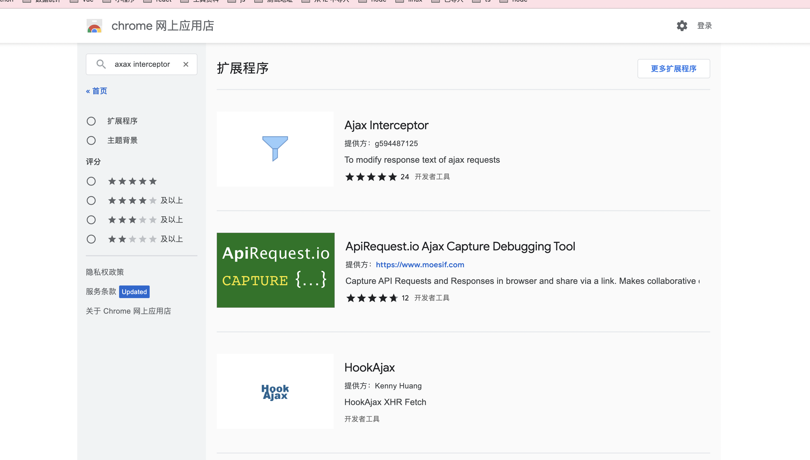
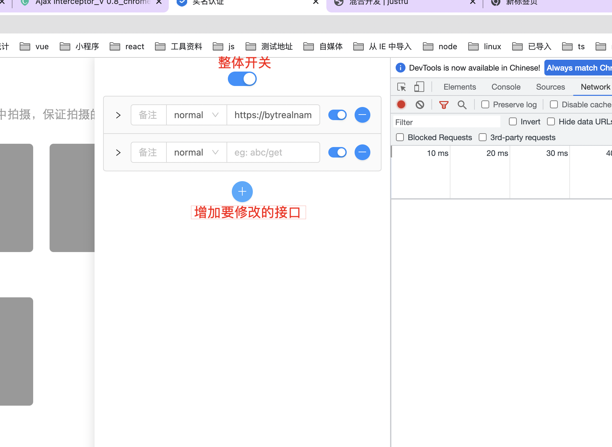
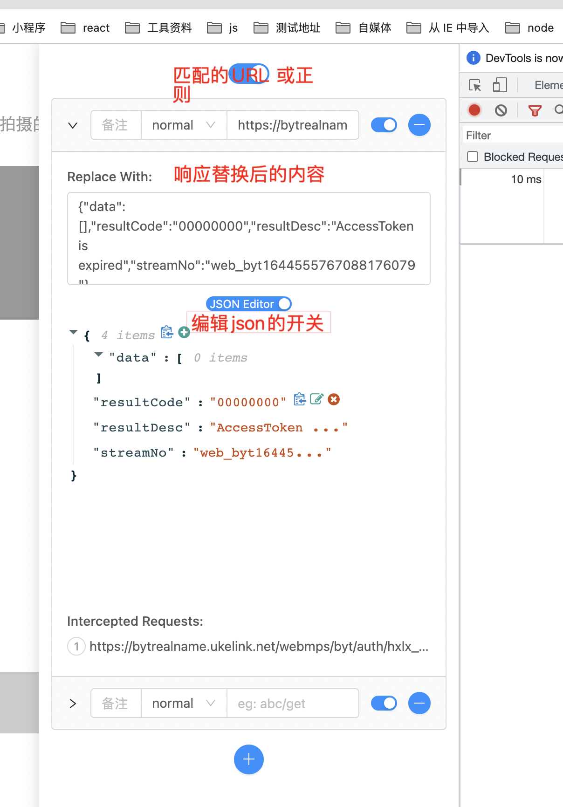

# 混合开发
## 原生与h5通信
一、 APP内嵌H5页面通讯 dsBridge

dsBridge是三端易用的现代跨平台 Javascript bridge， 通过它，你可以在Javascript和原生之间同步或异步的调用彼此的函数.

下面介绍一下在vue中如何使用dsBridge

1. 安装
```shell
npm install dsbridge@3.1.4
```

2. 新建js文件 src\utils\dsbridge.js

```javascript
var dsBridge = require('dsbridge')
export default {
  callmethod (name, data, callback) {
    callback(dsBridge.call(name, data, callback))
  },
  registermethod (tag, callback) {
    dsBridge.register(tag, callback)
  }
}
```

3. mian.js中引入

```javascript
import Bridge from '@/utils/dsbridge.js'
Vue.prototype.$bridge = Bridge

```

4. 在vue中使用

```javascript
  //1. h5调用原生的方法
  var data = {};//data为传给app的参数
  this.$bridge.callmethod('nativeTunnel', data, (res) => { // nativeTunnel为方法名
    // 注意this指向问题
    alert(res) // 这里能拿到app的返回值哦!
  })

  //2. 原生调用h5方法
  this.$bridge.registermethod('h5methods', (data) => { // h5methods为方法名
     alert(data) // app端给前端的数据在这里
     return {a: 'xxx'} // 前端返回给app的值
  })
```

## h5调试
edge://inspect/#devices

## 设置webView需要的一些基本的属性
```
1、设置可以javascript
      webview.getSettings().setJavaScriptEnabled(true);
2、设置webView可以打开窗体
      webview.getSettings().setJavaScriptCanOpenWindowsAutomatically(true);
3、设置不显示滚动条
      webview.setVerticalScrollBarEnabled(false); （竖向）
      webview.setHorizontalScrollBarEnabled(false); （横向）
4、设置网页字体不跟随系统字体发生改变
      webview.getSettings().setTextZoom(100);
5、设置默认编码格式
      webview.getSettings().setDefaultTextEncodingName("utf-8");
6、设置可以调用数据库
       webview.getSettings().setDatabaseEnabled(true);
7、设置dom存储
       webview.getSettings().setDomStorageEnabled(true);
```
## 控制字体 随系统变大而变大
https://blog.csdn.net/u010285974/article/details/80507643


## 浏览器插件推荐
**ajax interceptor**


你可以用该插件修改页面上Ajax请求的返回结果。
注意：
1. 建议第一次安装完重启浏览器，或者刷新你需要使用的页面。
2. 当你不需要使用该插件时，建议把开关关上（插件icon变为灰色），以免对页面正常浏览造成影响。
3. 该插件只会在JS层面上对返回结果进行修改，即只会修改全局的XMLHTTPRequest对象和fetch方法里的返回值，进而影响页面展现。而你在chrome的devtools的network里看到的请求返回结果不会有任何变化。
[github地址](https://github.com/YGYOOO/ajax-interceptor)

> >**本身的界面**


> >**修改后的界面**


