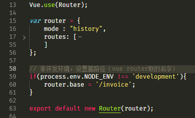
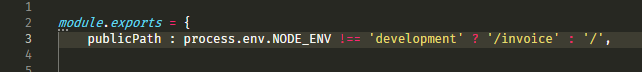

# 1.Nginx 编译安装/动态添加模块
**写在前面的话**

此文记录我学习nginx之路，现在以nginx1.20.2为例

**编译安装**

我们可以前往 Nginx 的官网下载我们的源码安装包
```javascript
//下载地址：http://nginx.org/en/download.html
```
对于生产应用，稳定放在第一位，所以我们选择下载 Stable 版本。

1. 先下载一些常用的包和模块
```
rewrite需要的PCRE库源码包
https://ftp.pcre.org/pub/pcre/

gzip 模块所需的zlib库源码包
http://www.zlib.net/

ssl功能所需要的openssl库源码包
https://www.openssl.org/source/

文件下载界面美化模块
https://github.com/aperezdc/ngx-fancyindex

上传模块
https://github.com/winshining/nginx-upload-module

cache 处理模块
https://github.com/FRiCKLE/ngx_cache_purge/

fair负载均衡调度模块
https://github.com/
```
2. 安装目录设计和用户设计

解压安装包

mkdir -p /usr/locale/nginx20
mkdir -p /opt/data/packages  
cd /opt/data/packages  
tar -zxf nginx-1.20.2.tar.gz  

cd /opt/data/packages/nginx-1.20.2

```
编译检测

```


# 2.Nginx 基本配置和日志处理

# 3.Nginx location/root/alias
# 4.Nginx rewrite/if/return/set和变量
# 5.Nginx TCP/正向/反向代理/负载均衡
# 6.Nginx 文件下载/用户认证
# 7.Nginx 状态统计/状态码统计
# 8.Nginx 安全优化/信息隐藏/请求限制/白名单
# 9.Nginx 静态压缩/日志切割/防盗链/恶意解析/跨域
# 10.Nginx 后面有无/的区别
# 11.Ngixn 项目中遇到的问题
1. 统一域名多站点nginx配置
假设站点A地址是http://demo.justfu.net，是统一域名地址，站点B地址是http://www.justfu.net。通过配置nginx和站点B的webpack和路由实现用站点A http://demo.justfu.net/invoice访问站点B。
```
首先设置站点A的nginx：

location /invoice{
    rewrite ^(.*)$ $1 break;
    proxy_pass "http://www.justfu.net";
}
```
如果站点B 的nginx有转发，得把站点B的nginx转发写到站点A里。例如，站点B的nginx有一个转发到/bss的配置
```
location /bss{
    proxy_pass "https://saas82.ukelink.net";
}
```
需要要把这个复制到站点A的nginx配置里  
设置站点B的vue路由：  
  
这样，在非开发环境访问页面时，得从http://www.justfu.net改成http://www.justfu.net/invoice  
tips: 关于base的说明，参考https://router.vuejs.org/zh/api/#base  
**设置站点B的webpack**  
如果使用vue cli3打包，在vue.config.js里添加这条publicPath配置：  
  
这样，打包出来写入到index.html的路径文件会加上/invoice。比如原index.html的script引入路径是/js/app.js，现在变成了/invoice/js/app.js。

如果使用原始webpack打包，好像是要修改output.publicPath = '/invoice/' (待验证);  
tips: 关于vue cli3 publicPath的说明，参考https://cli.vuejs.org/zh/config/#publicpath。
```
给站点B的nginx添加一条配置：
location /invoice{
    rewrite ^/invoice(.*)$ /$1 last;
}
```
完成上面操作，站点B可以通过http://www.justfu.net访问， 也可以通过http://demo.justfu.net/invoice访问了。


https://www.cnblogs.com/Dy1an/category/1491372.html
                                                                                                                                                                                         